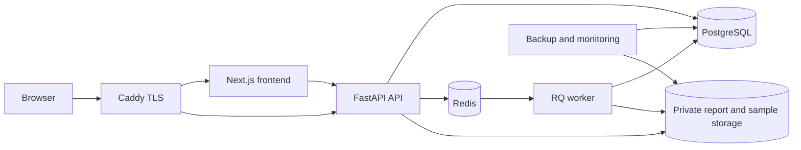
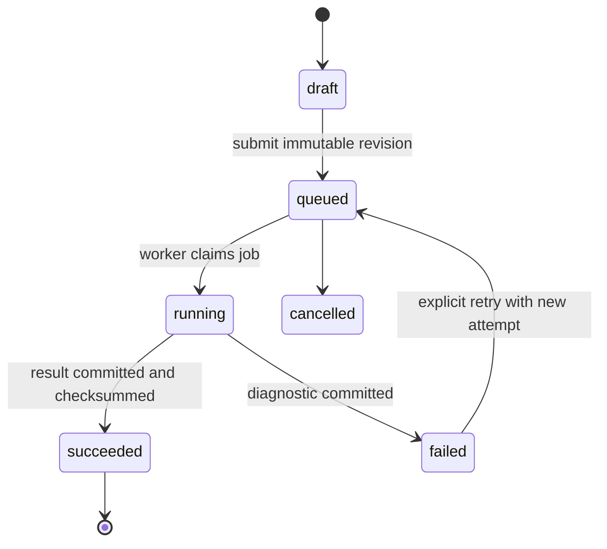

# StartupValue — Arquitetura proposta

Data: 2026-09-22. Estado: arquitetura de referência anterior à implementação. Modelo inicial proposto: `3.0.0-draft`; publicação de `3.0.0` depende dos gates numéricos, de segurança e de operação.

## Decisão arquitetural

Construir um monólito modular com frontend e worker separados em runtime. Next.js entrega interface e páginas públicas. FastAPI é a única autoridade de domínio e persistência. PostgreSQL mantém dados transacionais, snapshots e resumos; Redis transporta jobs e cache descartável; worker RQ executa NumPy/SciPy e PDF. Caddy termina TLS e roteia. Essa topologia cabe em uma VPS, mantém fronteiras internas e permite separar serviços quando houver evidência operacional.



Não colocar fórmulas, autenticação de dados ou geração de PDF em componentes React. O frontend pode formatar números já calculados e derivar somente estado de apresentação.

## Estrutura do repositório

```text
apps/frontend/                 Next.js App Router, TypeScript
apps/backend/app/api/          routers, schemas, dependencies
apps/backend/app/auth/         sessions, password reset, policy
apps/backend/app/domain/       entities, services, permissions
apps/backend/app/valuation/    dcf, terminal, vc, dilution, bridges
apps/backend/app/simulation/   rng, distributions, paths, statistics
apps/backend/app/decision/     drivers, targets, comparisons, narrative
apps/backend/app/tax/          versioned simplified estimators
apps/backend/app/reports/      report DTO, HTML/A4, Playwright adapter
apps/backend/app/jobs/         enqueue, worker tasks, idempotency
apps/backend/app/observability/logging and health
packages/contracts/            generated OpenAPI client/types
infra/caddy/ infra/scripts/    proxy, backup, restore, deploy
tests/                         integration, E2E and fixtures
docs/                          specifications and operating guides
legacy/                        preserved prototype
```

Python modules import inward: API/adapters → application services → pure domain/engines. Engines receive typed immutable inputs and return typed outputs; they do not read environment, database, HTTP or locale. Tax and report depend on contracts, not UI.

## Bounded modules

| Module | Responsibility | Excludes |
|---|---|---|
| Identity | users, password credentials, sessions, reset tokens | workspace business rules |
| Tenancy | workspaces, memberships, roles, scoped authorization | valuation math |
| Companies | startup profile and lifecycle | scenario snapshots |
| Scenarios | editable drafts and immutable revisions | job execution |
| Valuation | FCFF, DCF, terminal, EV/equity, VC and round math | random sampling |
| Simulation | RNG, distributions, trajectories, states and aggregates | HTTP/persistence |
| Decision | drivers, target hit/miss, sensitivity, comparison, narratives | new random draws |
| Tax | simplified time-versioned tax policies and warnings | accounting advice |
| Reports | deterministic view model and PDF from saved result | recalculation |
| Billing | plans, entitlements and usage; provider adapter | provider secrets in frontend |
| Admin/Audit | operational views, immutable audit events | unrestricted tenant reads |

## Modelo de dados

Todos os recursos de negócio têm `workspace_id`; ownership não depende apenas de URL. IDs externos são UUID/ULID não sequenciais. Timestamps UTC, soft archive quando histórico precisa permanecer, hard delete por workflow LGPD.

Core:

- `users`, `password_credentials`, `sessions`, `password_reset_tokens`.
- `workspaces`, `workspace_memberships(role)`, `plans`, `entitlements`, `usage_ledger`.
- `startups(workspace_id, profile, currency, archived_at)`.
- `scenarios(startup_id, name, mode, current_revision_id, archived_at)`.
- `scenario_revisions(scenario_id, revision_no, canonical_inputs_json, input_hash, created_by)`; imutável.
- `simulations(scenario_revision_id, model_version, tax_version, seed, count, status, idempotency_key, timestamps, error_code)`.
- `simulation_results(simulation_id unique, schema_version, summary_json, result_hash, samples_object_key, samples_hash)`; imutável após sucesso.
- `target_analyses(simulation_result_id, target, method, basis, result_json)` e `scenario_comparisons` como artefatos derivados versionados.
- `reports(simulation_result_id, template_version, status, object_key, checksum)`; nunca contém cálculo divergente.
- `audit_events(workspace_id, actor_id, action, resource_type/id, metadata_redacted, created_at)`.

PostgreSQL guarda JSONB canônico e resumos consultáveis. Samples e trajetórias compactados ficam inicialmente em volume privado/object storage compatível, endereçados por chave aleatória e checksum; acesso ocorre somente pela API. O volume participa de backup. Não usar URL pública previsível. Se a operação futura exigir S3, o adapter troca sem alterar domínio.

## Estados e consistência



API cria `scenario_revision` e `simulation` em transação, reserva uso e enfileira depois de commit por outbox. Worker reivindica por ID; lock/advisory guard impede publicação dupla. Retry pode repetir o mesmo job/seed e substituir somente tentativa não publicada; resultado `succeeded` é imutável. Falha de enqueue é reconciliada pelo dispatcher da outbox.

`input_hash` usa JSON canônico com campos e unidades resolvidos. `result_hash` cobre manifesto e artefato. Seed é gerada e persistida antes da fila. Mesma revision, model version, seed, count e runtime digest deve ser reprodutível no ambiente suportado. Uma mudança de ordem de draws ou fórmula exige nova model version.

## Contrato do SimulationResult

Envelope: IDs e workspace; schema/model/tax/runtime versions; created_at; seed/count/RNG; method/basis/currency/horizon; input hash; estado/warnings. Conteúdo: contagens por estado; percentis P5/10/25/50/75/90/95, mean/variance/SD; massas zero/negativa; histogram/CDF/boxplot; séries anuais/mensais agregadas; breakeven; drivers; target inicial; DCF/VC reconciliations; referências e hashes dos samples.

Dashboard, narrative e PDF usam esse envelope. Uma análise de target lê os mesmos samples e grava artefato derivado; não altera SimulationResult. PDF monta `ReportData` apenas de resultado e perfil snapshotado. Teste de contrato compara números e identificadores em API, dashboard e PDF.

## APIs

Prefixo `/api/v1`. OpenAPI é fonte para client TypeScript. Respostas usam problem details com `code`, `message`, `field_errors`, `correlation_id`; stack trace nunca sai da API.

- `/auth/signup|login|logout|forgot-password|reset-password`, `/me`.
- `/workspaces`, `/memberships` conforme entitlement.
- `/startups`, `/startups/{id}`, archive/delete/export.
- `/scenarios`, `/scenarios/{id}`, `/duplicate`, `/revisions`.
- `POST /simulations` com idempotency key; `GET /simulations/{id}`; cancel quando ainda permitido.
- `GET /simulation-results/{id}` com views/resolução; `POST /target-analyses`; `POST /comparisons`.
- `POST /reports`; `GET /reports/{id}`; `GET /reports/{id}/download` autenticado ou link assinado curto e single-purpose.
- `/health/live`, `/health/ready`; readiness verifica Postgres e Redis com timeout.
- `/admin/*` com role explícita, auditada e paginação.

Listas sempre filtram workspace antes de outros predicados. Services recebem `ActorContext`; repository exige `workspace_id`. PostgreSQL RLS pode reforçar defesa, usando contexto transacional e testes que falham fechado. Admin não reutiliza escopo comum silenciosamente.

## Segurança de sessão

Sessão opaca aleatória em cookie `Secure`, `HttpOnly`, `SameSite=Lax`, path restrito; hash do token no banco; rotação em login/alteração sensível; expiração absoluta e idle. Senha Argon2id. CSRF por token ligado à sessão para mutações quando cookie auth; validação Origin/Host como defesa adicional. Reset token aleatório, hash persistido, uso único e expiração curta. Rate limits por IP e identidade, com resposta genérica em login/reset.

Headers no Caddy/app: CSP por nonce sem `unsafe-inline`, HSTS após domínio validado, frame-ancestors none, nosniff, referrer policy e permissions policy. Segredos só por arquivos/env da VPS; logs redigem cookies, tokens e payload financeiro. Detalhes em `SECURITY.md`.

## Jobs e performance

RQ usa filas `simulation`, `report`, `maintenance`; timeouts e retry por classe. Erro de input não faz retry; indisponibilidade transitória tem backoff. Cada job registra fases e heartbeat. NumPy vetorizado usa float64 e limita threads BLAS no container para evitar contenção. Inicialmente um job de simulação por worker para controlar RAM. Chunking interno mantém ordem canônica; paralelismo ocorre entre jobs. Benchmark 1k/5k/10k/25k registra hardware, imagem, tempo e pico de memória antes de definir SLO.

Frontend carrega landing primeiro; hero 3D em dynamic import client-only após idle/intersection, com fallback 2D e reduced motion. Resultados grandes são agregados no endpoint; samples brutos não vão ao browser. Cache Redis nunca é fonte de verdade. Queries têm paginação, índices por workspace/status/date e limites de payload.

## PDF

Worker renderiza HTML A4 dedicado com Chromium/Playwright usando assets empacotados, sem URLs externas. ReportData é validado, locale BRL explícito e charts são SVG/PNG determinísticos. PDF inclui simulation ID, model version, seed, n, método/base e disclaimer. Geração guarda checksum e template version. Download passa autorização a cada acesso; Caddy não serve diretório de reports.

## Tax e versionamento

`tax_version` inclui regime, rule set e `effective_from/to`. Projeção que cruza vigências aplica regra por período ou informa não suportado. `simplified_estimate` é distinto de `detailed_model`. “Otimizar” não existe até haver elegibilidade, regras completas, testes e revisão contábil. Engine retorna breakdown e warnings; não lê labels da UI.

## Observabilidade

Logs JSON com timestamp, level, service, correlation/job/workspace hashed IDs, route, duration e status; nunca inputs financeiros completos. Métricas: requests/latency/errors, queue depth/age, job time/failure, DB pool, report time, backup age. Traces opcionais usam correlation ID. Hook Sentry recebe contexto redigido e está desligado sem DSN. Audit events registram login, acesso/alteração/exclusão/exportação e download de relatório.

## Deployment e operação

Compose dev: frontend, backend, worker, postgres, redis. Compose prod adiciona Caddy, restart policies, healthchecks, volumes nomeados, resource limits e imagens por digest/tag imutável. Apenas Caddy publica 80/443; Postgres/Redis ficam na rede privada. Migrations Alembic rodam como job único antes da troca. Deploy: backup→pull/build→migration compatível→healthcheck→switch/restart→smoke. Rollback de app usa imagem anterior; migration destrutiva exige expand/contract.

Backups diários do Postgres e storage, criptografados fora da VPS, retenção definida e restore ensaiado. Redis não entra no backup funcional. RPO/RTO só são anunciados após teste medido. `DEPLOY_VPS.md` contém comandos e runbooks.

## Estratégia de testes

- Unitários e property tests nos motores puros; fixtures independentes e tolerâncias justificadas.
- Integração com Postgres/Redis reais em containers: transações, outbox, retry, migrations e autorização.
- Contract tests SimulationResult/ReportData/OpenAPI.
- E2E Playwright: signup→criar→wizard→job→resultado→target→PDF→logout/login.
- Segurança: matriz cross-tenant para cada recurso, CSRF/session, rate limit, IDOR e downloads.
- Reprodutibilidade em imagem fixa; PDF extraído/visual; responsive e acessibilidade automatizada + manual.

## Migração por gates

1. Congelar originais em `legacy/` com hashes; criar monorepo, lint/test e Compose local.
2. Implementar engines puros e testes; nenhum endpoint comercial antes dos golden gates.
3. Banco/migrations, tenancy/auth e scenario revisions; testes cross-tenant.
4. Jobs, resultados imutáveis e target derivado; benchmark real.
5. Frontend landing/auth/dashboard/wizard/result usando API; E2E e a11y.
6. PDF da mesma fonte; segurança de download e validação visual.
7. Billing abstraído, admin mínimo, LGPD, backups, Caddy e runbooks.
8. Staging VPS, restore/rollback/health/load/security checks; somente depois produção.

## ADRs iniciais

- ADR-001 monólito modular em vez de microservices.
- ADR-002 FastAPI como autoridade, sem fórmulas no Next.js.
- ADR-003 PostgreSQL fonte de verdade; Redis efêmero.
- ADR-004 SimulationResult imutável e samples privados reutilizados.
- ADR-005 PCG64/float64/imagem fixada por versão.
- ADR-006 sessão opaca server-side em cookie e CSRF ligado à sessão.
- ADR-007 Playwright A4 dedicado, sem print da UI.
- ADR-008 Caddy em VPS por TLS automático e configuração pequena.
- ADR-009 model `3.0.0` para correções incompatíveis com legacy v2.

## Gate arquitetural

Não considerar production-ready enquanto qualquer fórmula estiver no frontend, resultado puder existir sem revision/model/seed/hash, PDF recalcular, query não exigir tenant, sample tiver URL pública, migrations não forem reversíveis por processo, ou restore/rollback não tiver evidência executada.

